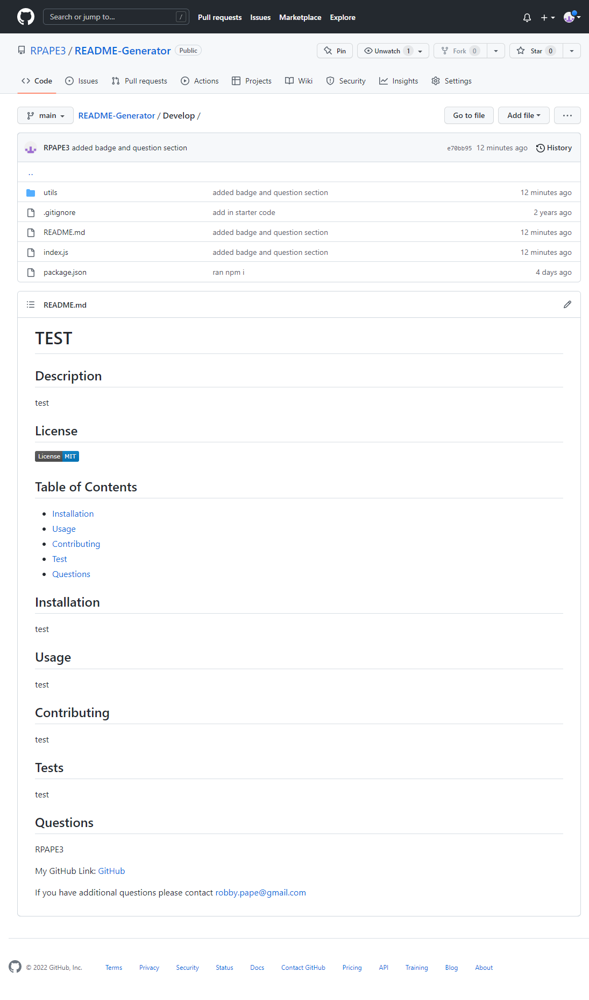

Project Title: README-Generator

Project Description: This interactive node application with inquirer allows the user to answer questions to generate a customized README.md file. The README.md will display license badge, links to the users GitHub account, email address and table of contents that will have internal links. 
 
 Link: https://github.com/RPAPE3/README-Generator

Screenshots: 

